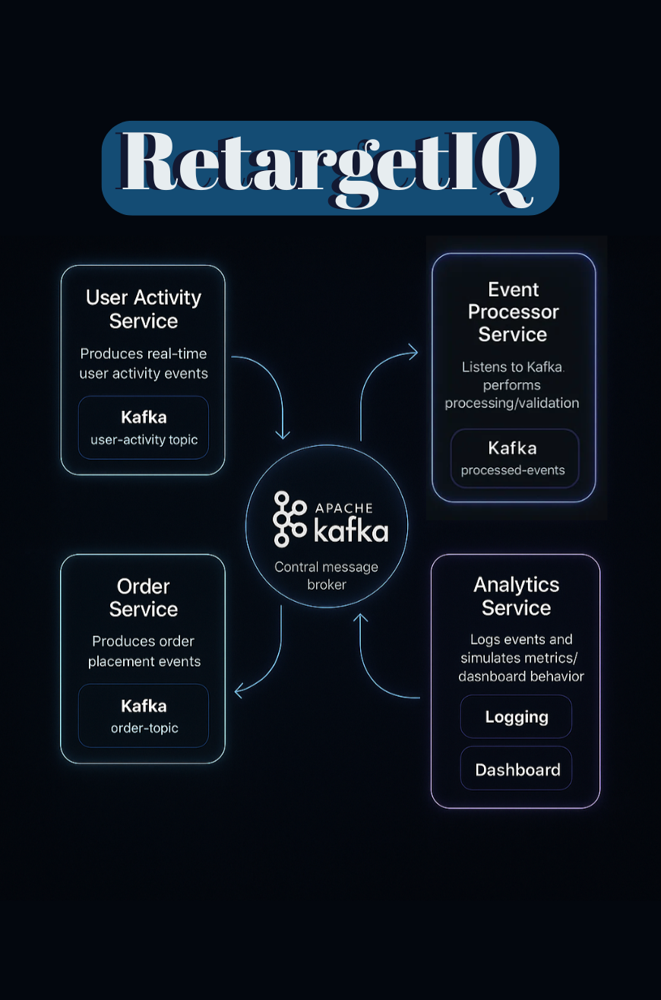

# RetargetIQ – Real-Time Kafka Microservices System

**RetargetIQ** is a real-time backend system simulating how large-scale platforms process user behavior and transactions using event-driven architecture. Developed during my internship at **DTDL**, this project replicates a simplified yet realistic production pipeline using **Spring Boot**, **Apache Kafka**, and **Docker**.

---

## 📦 Overview

This project contains 4 independent microservices:

1. **User Activity Service** – Produces simulated user interactions (e.g. views, clicks).
2. **Order Service** – Produces simulated product orders.
3. **Event Processor Service** – Consumes raw events, performs centralized processing/logging.
4. **Analytics Service** – Consumes final events for analysis/logging (e.g. dashboards).

All services communicate via Kafka topics using **asynchronous messaging**, decoupling producers from consumers.

---

## 🧠 Why This Project Was Built

This was my first real-world microservices project, built as an onboarding task at DTDL. It helped me:
- Understand the structure of production-grade backend systems
- Learn how Kafka manages real-time data across services
- Get hands-on with service orchestration using Docker
- Build confidence to contribute to DTDL’s actual backend

---

## 🧱 Services & Topics

### 1. **User Activity Service**
- **Kafka Topic**: `user-activity-topic`
- **Endpoint**:  
  `POST http://localhost:8081/api/users/activity`
- **Payload Sent**:  
  Random `userId`, `activityType`, `timestamp`
- **Tools Used**: `KafkaTemplate`, Spring REST

---

### 2. **Order Service**
- **Kafka Topic**: `order-topic`
- **Endpoint**:  
  `POST http://localhost:8082/api/orders/place`
- **Payload Sent**:  
  Random `orderId`, `userId`, `amount`, `timestamp`
- **Tools Used**: `KafkaTemplate`, Spring REST

---

### 3. **Event Processor Service**
- **Consumes From**:  
  `user-activity-topic`, `order-topic`
- **Kafka Listener**:  
  Processes raw events and logs them in a formatted way
- **Central Logic Layer**:  
  In production, this could validate, enrich, or route data

---

### 4. **Analytics Service**
- **Consumes From**:  
  `user-activity-topic`, `order-topic`
- **Kafka Listener**:  
  Logs final events and performs basic analytics
- **Extendable To**:  
  Metrics dashboard, alerts, reporting APIs

---

## 🗺️ Architecture Diagram



---

## ⚙️ Tech Stack

- Java 17  
- Spring Boot  
- Apache Kafka  
- Docker & Docker Compose  
- Maven  
- SLF4J + Lombok

---

## 🚀 Running the System

### Prerequisites
- Docker
- Docker Compose

### Steps to Run
```bash
git clone https://github.com/paridhi-sharmaaa/RetargetIQ.git
cd RetargetIQ
docker-compose up --build
```

**How to Test the System**

###Trigger User Event:
POST http://localhost:8081/api/users/activity

###Trigger Order Event:
POST http://localhost:8082/api/orders/place

Each call sends a randomly generated payload to the corresponding Kafka topic.

**Watch Kafka Event Flow:**
1. event-processor-service logs processed payloads.
2. analytics-service logs final summaries.
3. Logs appear in Docker container terminals or via:
   ```
   docker logs <container_name>
   ```
   
**Project Highlights**
1. Real-world service structure and separation of concerns
2. Clean Docker orchestration (docker-compose.yml)
3. Kafka topics with both producers and multiple consumers
4. Simple logging pipelines for validation and debugging
5. Structured project setup for each service

**Roadmap**
1. Add persistence to MongoDB/PostgreSQL in analytics-service
2. Expose REST APIs to fetch aggregated data
3. Add schema validation + retry logic in processors
4. Build a UI dashboard using React/Grafana
5. Write JUnit tests for all services

**Author**
Paridhi Sharma
Backend Engineering Intern – DTDL
B.Tech | 2nd Year
🔗 **LinkedIn:** https://www.linkedin.com/in/theparidhisharma/
📧 paridhi0203sharmaaa@gmail.com

